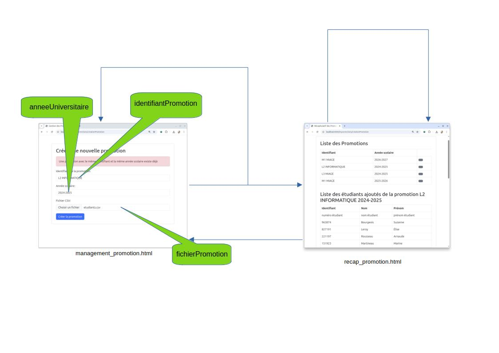

= TP : Authentification des utilisateurs dans une application Spring MVC avec variables de session
:author: BOICHUT Yohan
:revnumber: 1.0
:icons: font
:toc: left
:toclevels: 2
:sectnums:

== Objectifs

L'objectif de ce TP est de vous apprendre à factoriser l'affichage HTML d'une application Spring MVC grâce à l'utilisation de **layouts** avec **Thymeleaf**. Vous mettrez en place une structure commune (entête, pied de page, styles, etc.) et l'utiliserez dans toutes les vues de votre application.

Vous en profiterez également pour personnaliser le rendu graphique avec une feuille de style CSS.

== Étape 1 : Dépendance `thymeleaf-layout-dialect`

Ajoutez la dépendance suivante à votre fichier `pom.xml`, afin de permettre la gestion des layouts :

[source,xml]
----
<dependency>
    <groupId>nz.net.ultraq.thymeleaf</groupId>
    <artifactId>thymeleaf-layout-dialect</artifactId>
</dependency>
----

== Étape 2 : Création du layout principal

Dans le dossier `src/main/resources/templates`, créez un fichier nommé `layout.html`.

Ce fichier contiendra la structure principale de toutes vos pages HTML :

[source,html]
----
<!DOCTYPE html>
<html xmlns:th="http://www.thymeleaf.org"
      xmlns:layout="http://www.ultraq.net.nz/thymeleaf/layout">
<head>
    <meta charset="UTF-8">
    <title layout:fragment="title">Page</title>
    <link rel="stylesheet" th:href="@{/css/styles.css}"/>
</head>
<body>

<header>
    <h1 layout:fragment="headerTitle">Evènements en ligne</h1>
    <h2 layout:fragment="headerSubtitle">Ma section</h2>
</header>

<main layout:fragment="content">
    <!-- contenu par défaut ou vide -->
</main>

<footer>
    &copy; 2025 - Mes événements en ligne
</footer>

</body>
</html>
----

== Étape 3 : Utilisation du layout dans vos pages

Pour chaque page HTML de votre application, commencez par utiliser la déclaration suivante afin d'étendre le layout global :

[source,html]
----
<!DOCTYPE html>
<html xmlns:th="http://www.thymeleaf.org"
      xmlns:layout="http://www.ultraq.net.nz/thymeleaf/layout"
      layout:decorate="~{layout}">
----

Ensuite, vous pourrez personnaliser les fragments (`title`, `headerTitle`, `headerSubtitle`, `content`, etc.) comme dans l'exemple suivant pour la page de connexion :

[source,html]
----
<!DOCTYPE html>
<html xmlns:th="http://www.thymeleaf.org"
      xmlns:layout="http://www.ultraq.net.nz/thymeleaf/layout"
      layout:decorate="~{layout}">
<head>
    <title layout:fragment="title">Page de connexion</title>
</head>
<body>

<h1 layout:fragment="headerTitle">Gestion d'évènements en ligne</h1>
<h2 layout:fragment="headerSubtitle">Connexion à l'application</h2>

    <form th:action="@{/mesevenements/login}" th:object="${authentificationDTO}" method="post">

        <!-- Erreur personnalisée -->
        

        

            <label for="email">Email :</label>
            <input type="text" id="email" th:field="*{email}">
            
        

        

            <label for="motDePasse">Mot de passe :</label>
            <input type="password" id="motDePasse" th:field="*{motDePasse}">
            
        

        <button type="submit">Se connecter</button>
    </form>

</body>
</html>
----

== Étape 4 : Mise à jour de l’application

. Adaptez **toutes les pages HTML** de votre application afin qu’elles utilisent le layout principal défini dans `layout.html`.
. Remplacez les blocs HTML communs (entête, titre, pied de page) par les fragments personnalisés.

== Étape 5 : Amélioration de l’apparence avec CSS

Créez une feuille de style CSS nommée `styles.css` dans le dossier `static/css/` de votre projet.

Commencez avec une structure simple :

[source,css]
----
body {
    font-family: Arial, sans-serif;
    margin: 0;
    padding: 0;
    background-color: #f9f9f9;
    color: #333;
}

header {
    background-color: #0066cc;
    color: white;
    padding: 1em;
    text-align: center;
}

footer {
    background-color: #eee;
    padding: 0.5em;
    text-align: center;
    font-size: 0.9em;
    color: #666;
}

.error-message {
    color: red;
    font-size: 0.9em;
}
----

[IMPORTANT]
====
Vous pouvez utiliser ChatGPT pour améliorer cette feuille de style. N'hésitez pas à lui demander une mise en page plus moderne, des effets de survol, des styles responsive, etc.
====

== Pour aller plus loin : Extension de l’application avec Spring MVC

Pour celles et ceux qui ont terminé les exercices précédents, vous pouvez poursuivre avec ce défi final.

=== Objectif

Vous allez réaliser une application Spring MVC permettant de téléverser un fichier CSV contenant les informations des étudiants d'une promotion, puis de les consulter depuis une interface web.

=== Modèle fourni

[source,java]
----
public class Etudiant {
    private String numeroEtudiant;
    private String nom;
    private String prenom;

    public Etudiant(String numeroEtudiant, String nom, String prenom) {
        this.numeroEtudiant = numeroEtudiant;
        this.nom = nom;
        this.prenom = prenom;
    }

    // Getters et Setters
}
----

[source,java]
----
/**
 * Interface définissant les opérations principales pour la gestion des promotions
 * dans le logiciel.
 */
public interface FacadeLogiciel {

    /**
     * Crée une nouvelle promotion à partir d'un fichier CSV, et l’ajoute à l’ensemble des promotions.
     *
     * @param identifiantPromotion identifiant unique de la promotion (ex: "L3INFO")
     * @param anneeScolaire année scolaire associée à la promotion (ex: "2024-2025")
     * @param fichierPromotion flux d’entrée contenant les données CSV de la promotion
     * @throws ConflitPromotionException si une promotion avec le même identifiant et la même année scolaire existe déjà
     */
    void creationNouvellePromotion(String identifiantPromotion, String anneeScolaire, InputStream fichierPromotion)
            throws ConflitPromotionException;

    /**
     * Récupère une promotion à partir de son identifiant et de son année scolaire.
     *
     * @param identifiantPromotion identifiant de la promotion recherchée
     * @param anneeScolaire année scolaire correspondante
     * @return la promotion correspondante, ou {@code null} si elle n'existe pas
     */
    Promotion getPromotion(String identifiantPromotion, String anneeScolaire);

    /**
     * Renvoie toutes les promotions actuellement connues dans le système.
     *
     * @return une collection contenant toutes les promotions chargées ou créées
     */
    Collection<Promotion> getPromotionsLibelles();
}
----

[source,java]
----
public class Promotion {
    private String identifiantPromotion;
    private String anneeScolaire;
    private Collection<Etudiant> etudiants;

    public Promotion(String identifiantPromotion, String anneeScolaire, InputStream fichierPromotion) {
        this.identifiantPromotion = identifiantPromotion;
        this.anneeScolaire = anneeScolaire;
        etudiants = Utils.parseEtudiants(fichierPromotion);
    }

    public Promotion(String identifiantPromotion, String anneeScolaire, Collection<Etudiant> etudiants) {
        this.identifiantPromotion = identifiantPromotion;
        this.anneeScolaire = anneeScolaire;
        this.etudiants = etudiants;
    }

    public String getIdentifiantPromotion() {
        return identifiantPromotion;
    }

    public String getAnneeScolaire() {
        return anneeScolaire;
    }

    public Collection<Etudiant> getEtudiants() {
        return etudiants;
    }
}
----

=== Exemple de fichier CSV

Le fichier à téléverser doit respecter le format suivant :

[source,csv]
----
numéro étudiant;nom étudiant;prénom étudiant
963874;Bourgeois;Suzanne
827191;Leroy;Élise
221197;Rousseau;Arnaude
151923;Martineau;Marine
740689;Dijoux;Brigitte
593161;Sauvage;Laurence
587796;Rodriguez;Arnaude
104981;Mercier;Marie
255920;Diallo;Michel
473955;Fleury;Corinne
349863;Bodin;Thibault
564094;Gomez;Édouard
908894;Rémy;Suzanne
334675;Millet;Claude
282545;Olivier;Emmanuel
101314;Garnier;Jeannine
445377;Lacroix;Virginie
126851;Vaillant;Louise
547319;Navarro;Joseph
876500;Thibault;Matthieu
811440;Mathieu;Timothée
579862;Imbert;Émilie
210567;Bègue;Monique
558214;Toussaint;André
899791;Lagarde;Thérèse
205999;Legrand;Agnès
344681;Moreau;Antoinette
825928;Maury;Émilie
385950;Salmon;Julie
737323;Roux;Auguste
----

=== Comportement attendu

Votre application Spring MVC doit permettre :

1. De déposer un fichier CSV contenant les étudiants d’une promotion en précisant l’identifiant de la promotion et l’année universitaire concernée.
3. De visualiser la liste des promotions enregistrées.
4. De consulter les étudiants d’une promotion donnée.

=== Rappel important

Au lancement de l'application, le constructeur de la façade recherche automatiquement les fichiers `.csv` dans le répertoire où se trouve la classe compilée (`target/classes` en général). Tant que vous ne supprimez pas ce répertoire, les promotions précédemment créées seront automatiquement rechargées à chaque exécution.

=== Carte de navigation attendue

Reproduisez l’interface de navigation suivante dans votre application :

